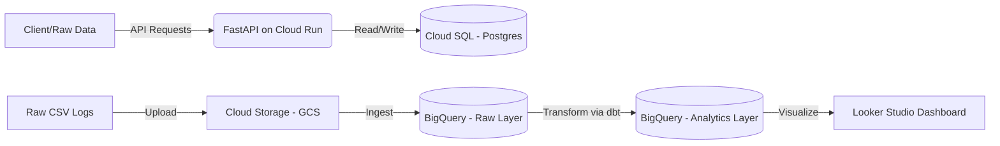

# Vertigo Case Study: Full Stack Data Engineering Pipeline


A complete end-to-end data engineering solution designed for the Vertigo Games case study. This project bridges Backend Engineering (FastAPI, Cloud Run, Cloud SQL) with Analytics Engineering (BigQuery, dbt, Looker Studio).

### 🚀 Live Links
- **Live API (Swagger UI):** [https://vertigo-api-1099379061874.us-central1.run.app/docs](https://vertigo-api-1099379061874.us-central1.run.app/docs)
- **Analytics Dashboard:** [Looker Studio Dashboard](https://lookerstudio.google.com/reporting/c82a9aa5-e03b-4efc-99a3-3ec9e49188fc)

---

## 📖 Project Overview
This repository contains a complete end-to-end data engineering solution designed for the Vertigo Games case study. The project is divided into two main domains:
Backend (Part1) : A scalable REST API built with FastAPI, containerized with Docker, and deployed on Google Cloud Run with a Cloud SQL (PostgreSQL) backend.

Data Analytics (Part2): An ELT (Extract, Load, Transform) pipeline moving raw telemetry data into Google BigQuery, transformed via dbt, and visualized in Looker Studio.


## 🏗 System Architecture

The data flows from the raw application to the final dashboard via the following pipeline:



 ## Methodology & Logic

 Part 1: Backend Implementation

Framework: Chosen FastAPI for its high performance, native asynchronous support, and automatic Swagger UI generation.

Database: Used PostgreSQL (via Google Cloud SQL) for reliable, relational data storage.

Containerization: The application is Dockerized to ensure consistency across local development and cloud environments.

Deployment: Utilized Google Cloud Run for a serverless approach.1 This allows the API to scale to zero when not in use (saving costs) and scale up automatically during high traffic.

Networking: The API connects to the database via Public IP (with authorized networks) for this case study to simplify VPC configurations.


Part 2: Analytics Pipeline (ELT)

Ingestion Strategy: instead of uploading 16+ compressed files individually, I utilized Google Cloud Storage (GCS) as a data lake staging area. This allows for bulk loading into BigQuery using paths (*.csv.gz).

Data Warehouse: BigQuery was selected for its ability to handle large datasets and separate storage from compute.2

Transformation (dbt): Used dbt (data build tool) to manage SQL logic.
Logic: The daily_metrics model aggregates raw logs by date, country, and platform.


## 📦 Installation & Usage
Follow these steps to deploy the project to Google Cloud Platform.

Prerequisites
Google Cloud SDK (gcloud) installed.

Docker Desktop running.

Python 3.9+.

1. Backend Deployment
Clone and Build:
```bash

# Clone the repository
git clone [https://github.com/busetolunay/Vertigo-Case.git](https://github.com/busetolunay/Vertigo-Case.git)
cd Vertigo-Case/backend
```
# Enable Registry & Submit Build
```bash
gcloud services enable containerregistry.googleapis.com
gcloud builds submit --tag gcr.io/YOUR_PROJECT_ID/vertigo-api
```
Deploy to Cloud Run:
```bash

gcloud run deploy vertigo-api \
  --image gcr.io/YOUR_PROJECT_ID/vertigo-api \
  --platform managed \
  --region us-central1 \
  --allow-unauthenticated \
  --set-env-vars POSTGRES_USER=postgres,POSTGRES_DB=vertigo_db,POSTGRES_HOST=YOUR_SQL_IP,POSTGRES_PASSWORD=YOUR_PASSWORD
```

Seed the Database:    We use a Cloud Run Job or Cloud Shell to seed the initial data since the DB is on a private network/cloud. i Created a Cloud Run Job in this case we can also:

```bash
# Run this inside Cloud Shell if DB is on a private network
python3 seed.py
```

# 2. Analytics Pipeline (dbt)
Setup Environment:

```bash
cd ../dbt_project
python -m venv dbt-env

# Activate Virtual Env
.\dbt-env\Scripts\activate on Windows
#source dbt-env/bin/activate  # macOS/Linux
pip install dbt-bigquery
```

Configure dbt: Update dbt_project.yml and profiles.yml with your BigQuery Project ID and Dataset location.

Run Models: Update your profiles.yml with your BigQuery credentials, then run:
```bash
dbt deps
dbt run
```
This compiles the SQL in models/daily_metrics.sql and creates the table in BigQuery.

## 📂 Project Structure
```bash
vertigo-case/
├── backend/                  # FastAPI Application
│   ├── src/
│   │   ├── main.py           # API Endpoints
│   │   ├── models.py         # SQLAlchemy Models
│   │   └── database.py       # DB Connection Logic
│   ├── Dockerfile            # Container instructions
│   └── seed.py               # Data seeding script
│
├── dbt_project/              # Analytics Transformation
│   ├── models/
│   │   ├── sources.yml       # Raw data definition
│   │   └── daily_metrics.sql # KPI Logic
│   └── dbt_project.yml       # dbt configuration
│
├── docker-compose.yml        # Local development setup
└── README.md                 # Documentation
```
## 📝 Assumptions & Notes
Network Security: For this case study, 0.0.0.0/0 was added to Cloud SQL authorized networks for ease of access from Cloud Run and local machines. In a production environment, a VPC Connector or Private IP would be used.

It is assumed that the provided .csv.gz files follow a consistent schema. SAFE_DIVIDE was used to handle potential data anomalies like 0 dau.
All revenue data is assumed to be in USD.

## 🏷️ Release
The final version of this project is tagged as v1.0. Check the Releases page for details.
